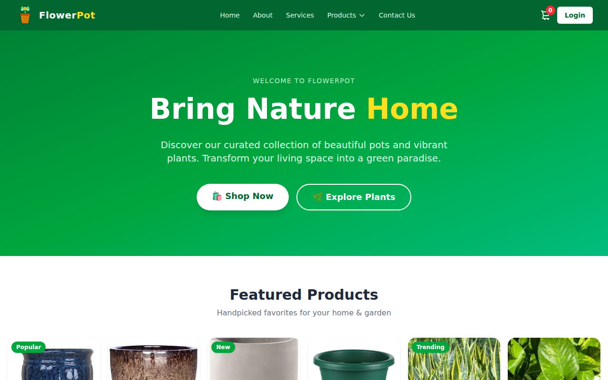
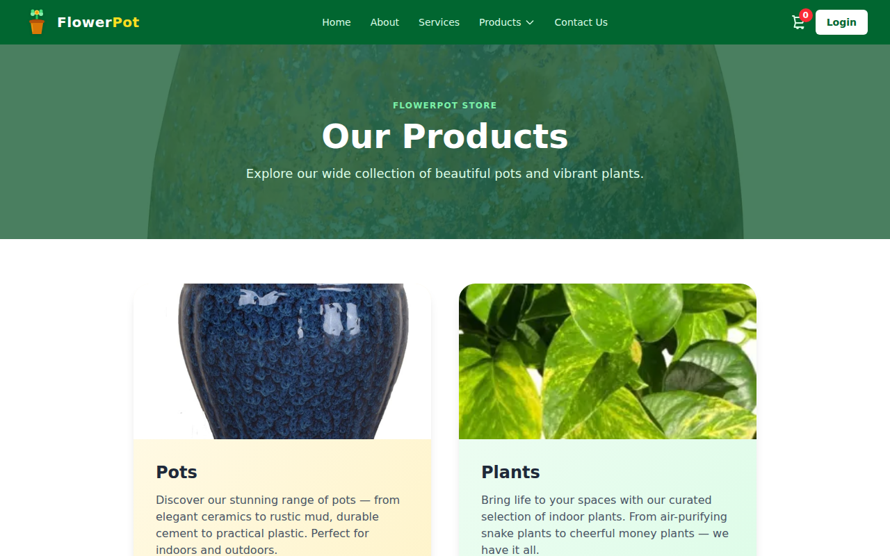
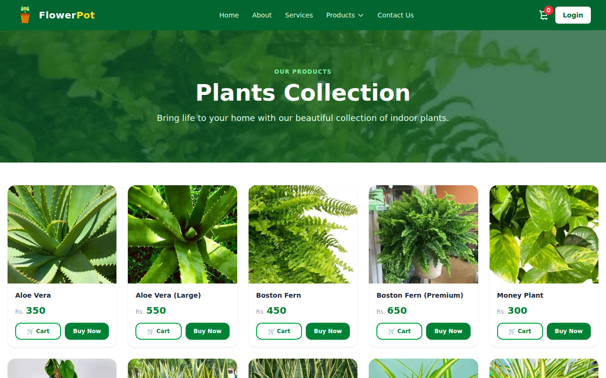
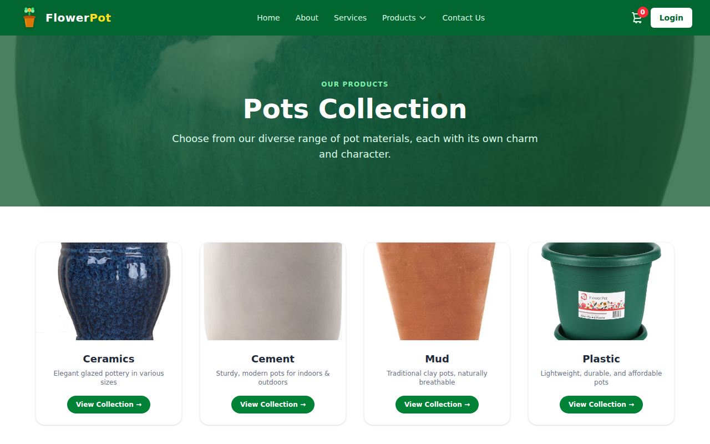
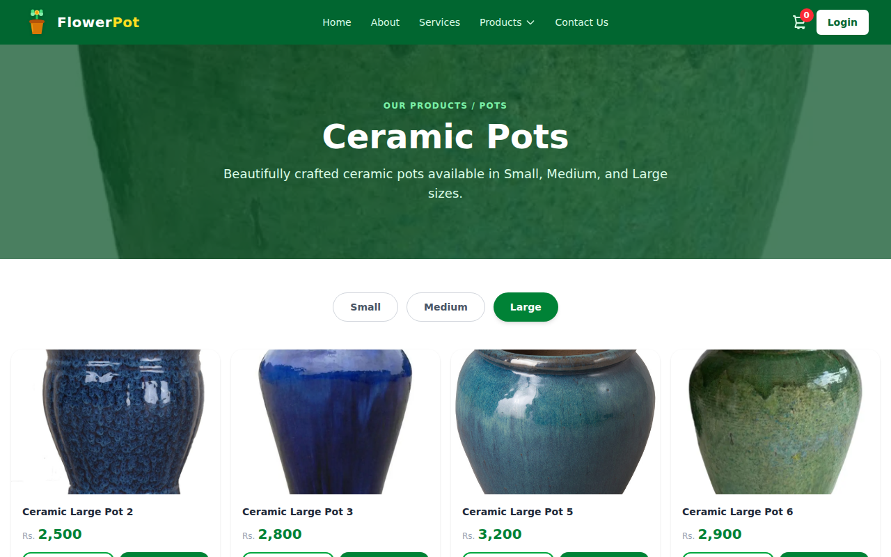
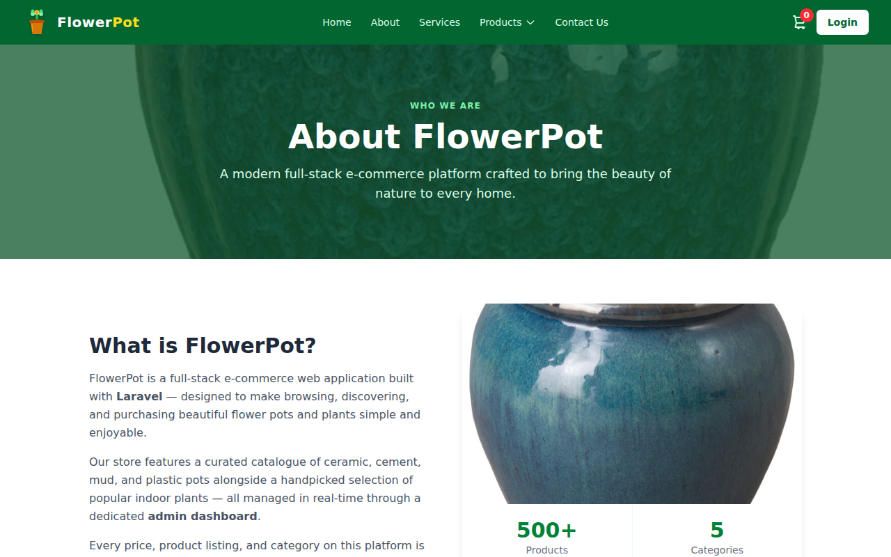
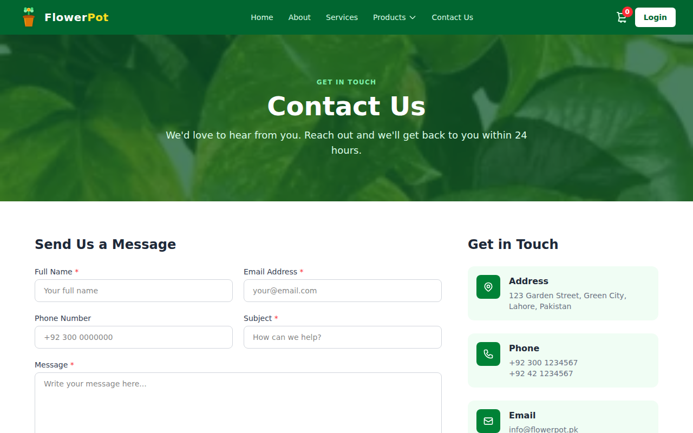

# 🌿 FlowerPot

A full-stack e-commerce web application for browsing and purchasing flower pots and plants,
built with **Laravel 12**, **Tailwind CSS**, **Alpine.js**, and **Vite**.

---

## ⚠️ START HERE — Get All Blade Files Into Your Folder

> All the blade files (`home`, `about`, `products`, `contact`, etc.) are on a **separate branch**.
> Your `main` folder does NOT have them yet. Run these 3 commands in your terminal first:

```bash
git fetch origin
git checkout copilot/build-ecommerce-frontend
git pull origin copilot/build-ecommerce-frontend
```

After this, open your `Flower-Pot` folder and you will see all these files ready to edit:

```
resources/views/
├── layouts/app.blade.php          ← navbar, footer, cart drawer
├── components/product-card.blade.php
├── home/index.blade.php
├── about.blade.php
├── services.blade.php
├── contact.blade.php
├── auth/login.blade.php
└── products/
    ├── index.blade.php
    ├── plants.blade.php
    └── pots/
        ├── index.blade.php
        ├── ceramics.blade.php
        ├── cement.blade.php
        ├── mud.blade.php
        └── plastic.blade.php
```

Then install dependencies and start the server:

```bash
composer install
npm install
npm run build
cp .env.example .env
php artisan key:generate
```

Open `.env` and set:
```env
SESSION_DRIVER=file
CACHE_STORE=file
```

Then:
```bash
php artisan serve
```

Open **http://127.0.0.1:8000** in your browser. ✅

> 💡 After editing any `.blade.php` file, just **refresh your browser** — no rebuild needed.
> Only run `npm run build` again if you edit `resources/js/app.js` or `resources/css/app.css`.

---

## 📸 Screenshots

### 🏠 Home Page


### 🛍 Products


### 🪴 Plants Collection


### 🏺 Pots


### 🎨 Ceramics


### ℹ️ About


### 📬 Contact


---

## ⚡ Get & Run the Latest Code (Terminal Commands)

Open VS Code, press **Ctrl + `** to open the integrated terminal, then run **all of these commands one by one**:

---

### ✅ Step 1 — Switch to the PR branch (where all new code lives)

```bash
git fetch origin
git checkout copilot/build-ecommerce-frontend
git pull origin copilot/build-ecommerce-frontend
```

---

### ✅ Step 2 — Install PHP packages

```bash
composer install
```

---

### ✅ Step 3 — Set up your environment file

```bash
cp .env.example .env
php artisan key:generate
```

Then open `.env` and update these lines:

```env
DB_CONNECTION=mysql
DB_HOST=127.0.0.1
DB_PORT=3306
DB_DATABASE=flower_pot
DB_USERNAME=root
DB_PASSWORD=your_password_here

SESSION_DRIVER=file
CACHE_STORE=file
```

> 💡 Setting `SESSION_DRIVER=file` and `CACHE_STORE=file` means no database is needed to browse the frontend.

---

### ✅ Step 4 — Install Node packages & build assets

```bash
npm install
npm run build
```

---

### ✅ Step 5 — Start the development server

```bash
php artisan serve
```

Your app will be live at 👉 **http://127.0.0.1:8000**

---

## 🔄 What Changed in This Branch

| File | What was updated |
|---|---|
| `resources/js/app.js` | Added Alpine.js **cart store** with localStorage — cart persists across pages |
| `resources/views/components/product-card.blade.php` | "🛒 Cart" → **"Add to Cart"** with live feedback ("✓ Added!") |
| `resources/views/components/product-card.blade.php` | **"Buy Now"** now adds item to cart AND opens the cart drawer |
| `resources/views/layouts/app.blade.php` | Cart icon badge now shows **live item count** |
| `resources/views/layouts/app.blade.php` | New **cart slide-out drawer** — view items, see total, clear cart |

---

## 🛠️ Editing the Blade Files

All page templates are in `resources/views/`. Open any of these in VS Code to edit:

```
resources/views/
├── layouts/app.blade.php          ← Navbar, cart drawer, footer (edit here for global changes)
├── components/product-card.blade.php  ← Product card (image, name, price, Add to Cart, Buy Now)
├── home/index.blade.php           ← Home page
├── products/index.blade.php       ← Products page
├── products/plants.blade.php      ← Plants listing
├── products/pots/index.blade.php  ← Pots category page
├── products/pots/ceramics.blade.php
├── products/pots/cement.blade.php
├── products/pots/mud.blade.php
├── products/pots/plastic.blade.php
├── about.blade.php
├── services.blade.php
└── contact.blade.php
```

After editing any blade file, just **refresh your browser** — no rebuild needed.

After editing `resources/js/app.js` or `resources/css/app.css`, run:

```bash
npm run build
```

---

## Prerequisites

| Tool | Version | Download |
|------|---------|----------|
| PHP | 8.2 or higher | https://www.php.net/downloads |
| Composer | any | https://getcomposer.org |
| Node.js & npm | 18 or higher | https://nodejs.org |
| Git | any | https://git-scm.com |

---

## Useful Commands

| What it does | Command |
|---|---|
| Start dev server | `php artisan serve` |
| Hot-reload assets while editing JS/CSS | `npm run dev` |
| Build assets for production | `npm run build` |
| Clear config cache | `php artisan config:clear` |
| Clear view cache | `php artisan view:clear` |

---

## License

Open-sourced under the [MIT license](https://opensource.org/licenses/MIT).
